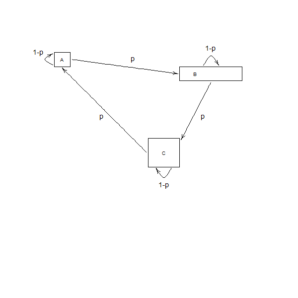
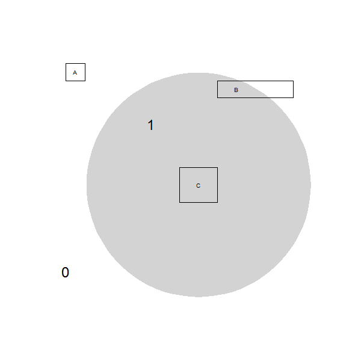
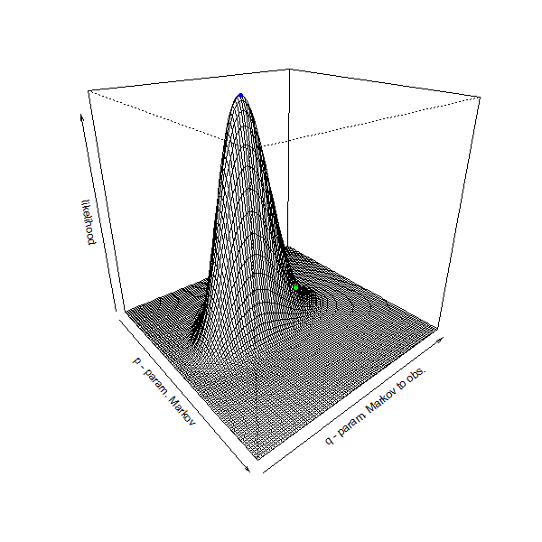
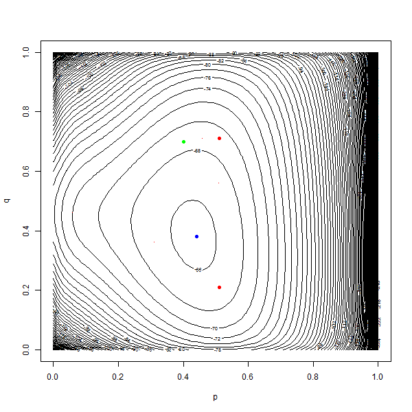

# Introduction to hidden Markov models

This code introduces hidden Markov models (on finite state spaces) and some techniques to solve those models, following the <a href="https://ahstat.github.io/images/2014-6-11-Introduction-hmm/rabiner1989tutorial_hmm.pdf" target="_blank">tutorial of L. R. Rabiner</a>.

It is specially designed to solve a homemade toy example. The problem can be described as follows: a consumer walks everyday between three places A, B and a shopping center C. A marketer, standing at C, only gets a noisy information about the position of the consumer. He tries to identify the location of the consumer.

You can check out the related blog post and beamer presentation here: https://ahstat.github.io/Introduction-hmm/

**Description of the problem**

*Consumer behavior*

The consumer behavior can be modeled as a Markov chain, as shown on the following figure:

 

*Observations from the marketer*

The marketer only has access to partial information, also modeled as a Markov chain (as a function of the hidden states of the consumer):

 

**Results**

*Likelihood of observations*

Given a sequence of observations and given parameters of the model, we can compute the likelihood of observations. This likelihood is easy to compute through forward decomposition.

Computing this likelihood on a grid, we can deduce the estimation of the parameters obtained from maximum likelihood:

 

On the figure, maximum likelihood estimation is the blue point; Green point corresponds to the true parameter, from which the sequences have been computed)

*Estimation of the best sequence*

We can use the Viterbi algorithm to obtain the best sequence (in the sense of the likelihood). This is also illustrated in the beamer presentation.

*Hard-EM algorithm*

We finally apply a simple EM algorithm (Expectation-Maximization), using Viterbi algorithm. Depending of the initialization of the algorithm, we obtain different results, represented in the following figure with red points:

 